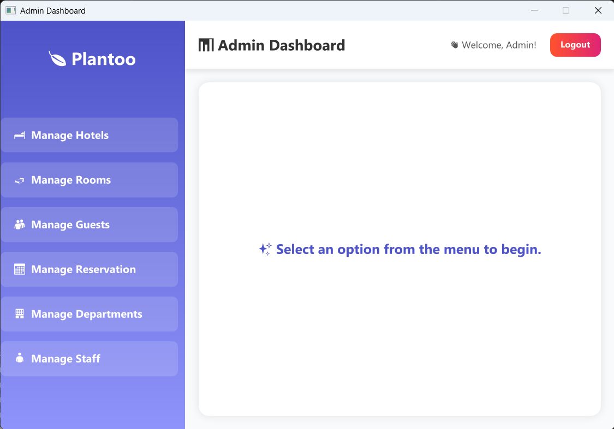
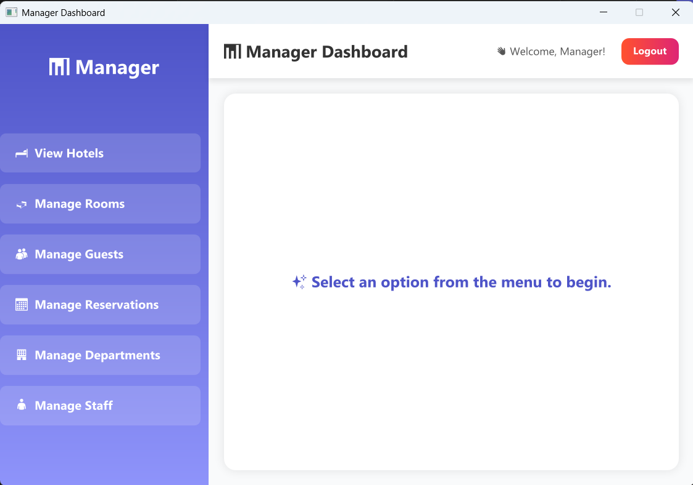
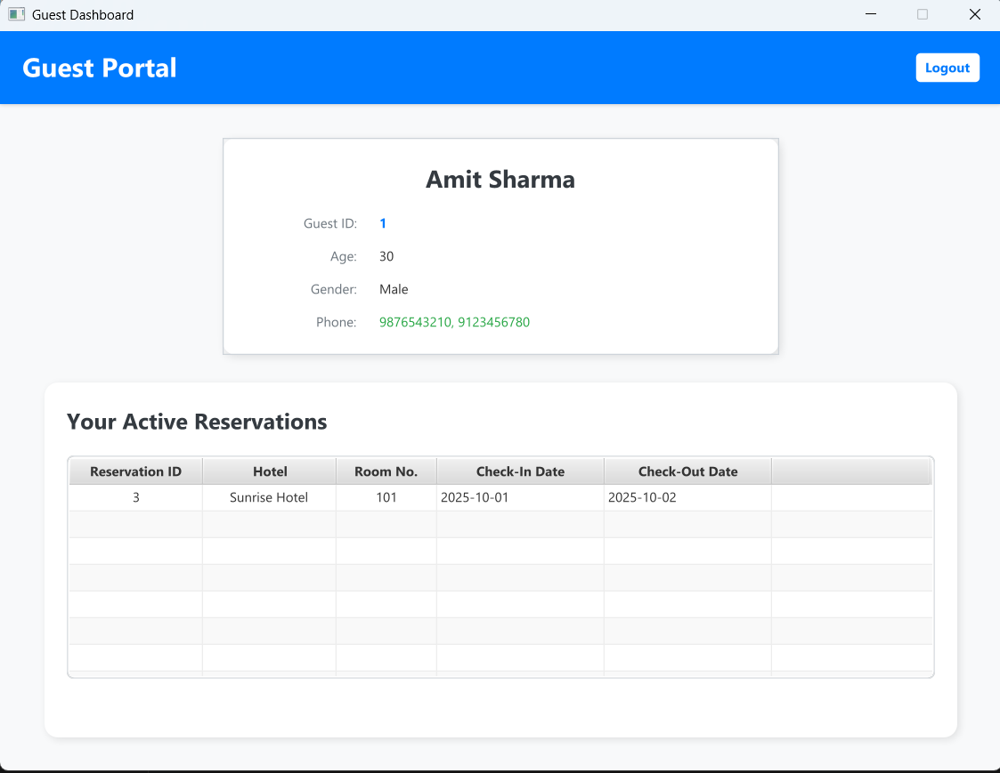

🏨 Hotel Management System

A modern Hotel Management System built using JavaFX, MySQL, and MVC architecture, designed to simplify hotel operations such as guest reservations, room management, and hotel administration — all through a clean and interactive user interface.

🖼️ Project Preview





✨ Features

✅ Guest Management

Register new guests and view guest information.

Manage guest reservations and update stay details.

✅ Reservation Management

Create, edit, and delete room reservations.

Track check-in/check-out dates and reservation status.

✅ Room Management

Add and view available rooms.

Assign rooms to guests efficiently.

✅ Hotel Admin Panel

Manage hotels, locations, and total rooms.

Update hotel contact information.

✅ Database Integration

MySQL database with full CRUD functionality using JDBC.

✅ User-Friendly Interface

Built using JavaFX and FXML, styled with modern design principles.


🧩 Project Structure
```text
Plantoo/
├── src/
│ ├── model/ # Data Models (POJOs mapping to DB tables)
│ │ ├── Hotel.java
│ │ ├── HotelContact.java
│ │ ├── Room.java
│ │ ├── Guest.java
│ │ ├── Reservation.java
│ │ ├── Department.java
│ │ ├── Staff.java
│ │ └── RoomType.java
│ │
│ ├── dao/ # Data Access Layer (CRUD for each table)
│ │ ├── HotelDAO.java
│ │ ├── RoomDAO.java
│ │ ├── GuestDAO.java
│ │ ├── ReservationDAO.java
│ │ ├── DepartmentDAO.java
│ │ └── StaffDAO.java
│ │
│ ├── controller/ # JavaFX Controllers (UI + Business Logic)
│ │ ├── AdminDashboardController.java
│ │ ├── DepartmentController.java
│ │ ├── GuestFormController.java
│ │ ├── GuestPanelController.java
│ │ ├── HotelFormController.java
│ │ ├── LoginController.java
│ │ ├── ManageDepartmentsController.java
│ │ ├── ManageGuestController.java
│ │ ├── ManageHotelsController.java
│ │ ├── ManagerDashboardController.java
│ │ ├── ManageReservationController.java
│ │ ├── ManageRoomsController.java
│ │ ├── ManageStaffController.java
│ │ ├── ReservationFormController.java
│ │ ├── RoomFormController.java
│ │ ├── StaffFormController.java
│ │ └── ViewHotelsController.java
│ │
│ ├── view/ # JavaFX UI Layouts (FXML Files)
│ │ ├── css/ # Stylesheets
│ │ └── Forms/ # Organized FXML Forms
│ │ ├── admin_dashboard.fxml
│ │ ├── guest_dashboard.fxml
│ │ ├── login.fxml
│ │ ├── manage_departments.fxml
│ │ ├── manage_guests.fxml
│ │ ├── manage_hotels.fxml
│ │ ├── manage_reservation.fxml
│ │ ├── manage_rooms.fxml
│ │ ├── manage_staff.fxml
│ │ ├── manageHotelViewOnly.fxml
│ │ └── manager_dashboard.fxml
│ │
│ ├── util/ # Utilities and Helpers
│ │ └── DBConnection.java # MySQL connection (Singleton pattern)
│ │
│ ├── resources/ # Optional assets (icons, config)
│ │ └── icons/
│ │
│ └── Main.java # Application entry point (launches login)
│
├── database/
│ ├── hotel_management.sql # Creates all tables + inserts sample data
│ └── ToClearData.sql # Safely clears all data
│
└── README.md
```

⚙️ Tech Stack
| Technology                  | Purpose                 |
| --------------------------- | ----------------------- |
| **JavaFX**                  | UI framework            |
| **FXML**                    | View design             |
| **MySQL**                   | Database                |
| **JDBC**                    | Database connectivity   |
| **MVC Pattern**             | Clean project structure |
| **IntelliJ IDEA / VS Code** | Development Environment |

🗃️ Database Setup
## 📸 Database Schema


---

## ⚙️ Setup Instructions

### 🗄️ 1. Create the Database

Open **MySQL** and run:

```sql
CREATE DATABASE hotel_management;
USE hotel_management;
```


📦 2. Import Tables

Run all table creation and sample data queries from:

    database/hotel_management.sql


To safely empty all tables, run:

    database/ToClearData.sql

🔐 3. Update Connection
Open DBConnection.java and update with your credentials:

    private static final String URL = "jdbc:mysql://localhost:3306/hotel_management";
    private static final String USER = "root";
    private static final String PASSWORD = "yourpassword";


🧠 How to Run (Step-by-Step)
🧩 Option 1 — IntelliJ IDEA

Open the Project
File → Open → select the project folder

Add JavaFX SDK

    Download JavaFX SDK from https://openjfx.io

In IntelliJ: File → Project Structure → Libraries → Add JavaFX SDK

Set VM Options (Run Configuration)
Go to Run → Edit Configurations → VM Options and add:

    --module-path "C:\path\to\javafx\lib" --add-modules javafx.controls,javafx.fxml


Build and Run

Click ▶ Run

The main window should open showing your hotel dashboard.

💻 Option 2 — Visual Studio Code

Install the following extensions:

    Extension Pack for Java

    JavaFX Support (optional but helpful)

    Download JavaFX SDK and extract it.

    Create a .vscode/launch.json file with:

    {
      "version": "0.2.0",
      "configurations": [
        {
          "type": "java",
          "name": "Run Hotel Management System",
          "request": "launch",
          "mainClass": "Main",
          "vmArgs": "--module-path \"C:\\path\\to\\javafx\\lib\" --add-modules javafx.controls,javafx.fxml"
        }
      ]
    }


Press F5 or click Run → Run Without Debugging.

🧑‍💻 Developers

Project By: Tarun Chaudhary
🎓 B.Tech IT | Shah & Anchor Kutchhi Engineering College
💡 Passionate about Java, Databases, and Modern UI Development.

🚀 Future Enhancements

 Add Login Authentication (Admin / Guest roles)

 Integrate Billing System

 Add Email Notifications for bookings

 Use Hibernate / Spring Boot for advanced data handling

💬 Feedback

     If you like this project, ⭐ the repository and share suggestions!
    Your feedback helps make this project even better.