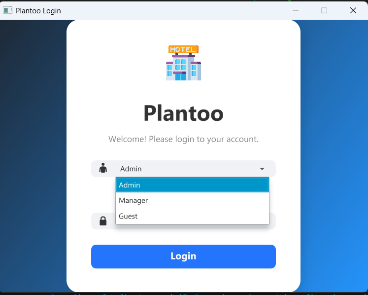

🏨 Hotel Management System

A modern Hotel Management System built using JavaFX, MySQL, and MVC architecture, designed to simplify hotel operations such as guest reservations, room management, and hotel administration — all through a clean and interactive user interface.

✨ Features

✅ Guest Management

Register new guests and view guest information.

Manage guest reservations and update stay details.

✅ Reservation Management

Create, edit, and delete room reservations.

Track check-in/check-out dates and reservation status.

✅ Room Management

Add and view available rooms.

Assign rooms to guests efficiently.

✅ Hotel Admin Panel

Manage hotels, locations, and total rooms.

Update hotel contact information.

✅ Database Integration

MySQL database with full CRUD functionality using JDBC.

✅ User-Friendly Interface

Built using JavaFX and FXML, styled with modern design principles.

🧩 Project Structure
HotelManagementSystem/
├── src/
│   ├── controller/
│   │   ├── GuestPanelController.java
│   │   ├── ManageReservationController.java
│   │   └── ...
│   ├── dao/
│   │   ├── GuestDAO.java
│   │   ├── ReservationDAO.java
│   │   └── RoomDAO.java
│   ├── model/
│   │   ├── Guest.java
│   │   ├── Reservation.java
│   │   ├── Room.java
│   │   └── Hotel.java
│   ├── util/
│   │   └── DBConnection.java
│   ├── view/
│   │   ├── login.fxml
│   │   ├── guest_panel.fxml
│   │   └── manage_reservation.fxml
│   └── Main.java
│
├── database/
│   └── hotel_management.sql
│
├── README.md
└── pom.xml or build.gradle (if applicable)

⚙️ Tech Stack
| Technology                  | Purpose                 |
| --------------------------- | ----------------------- |
| **JavaFX**                  | UI framework            |
| **FXML**                    | View design             |
| **MySQL**                   | Database                |
| **JDBC**                    | Database connectivity   |
| **MVC Pattern**             | Clean project structure |
| **IntelliJ IDEA / VS Code** | Development Environment |

🗃️ Database Setup
## 📸 Database Schema

Create the Database
Open MySQL and run the following:

CREATE DATABASE hotel_management;
USE hotel_management;

Import Tables
Run all table creation and sample data queries from
database/hotel_management.sql

Update Connection
Open DBConnection.java and update with your credentials:

private static final String URL = "jdbc:mysql://localhost:3306/hotel_management";
private static final String USER = "root";
private static final String PASSWORD = "yourpassword";

🧠 How to Run (Step-by-Step)
🧩 Option 1 — IntelliJ IDEA

Open the Project

Go to File → Open → select the project folder.

Add JavaFX SDK

Download JavaFX SDK from https://openjfx.io
.

Go to File → Project Structure → Libraries → Add JavaFX SDK.

VM Options (Run Configuration)
Add this under Run → Edit Configurations → VM Options:

--module-path "C:\path\to\javafx\lib" --add-modules javafx.controls,javafx.fxml

Build and Run

Click ▶ Run

The main window should open showing your hotel dashboard.

💻 Option 2 — Visual Studio Code

Install the following extensions:

Extension Pack for Java

JavaFX Support (optional but helpful)

Download JavaFX SDK and extract it.

Create a .vscode/launch.json file with:

{
  "version": "0.2.0",
  "configurations": [
    {
      "type": "java",
      "name": "Run Hotel Management System",
      "request": "launch",
      "mainClass": "Main",
      "vmArgs": "--module-path \"C:\\path\\to\\javafx\\lib\" --add-modules javafx.controls,javafx.fxml"
    }
  ]
}

Press F5 or click Run → Run Without Debugging.

🧑‍💻 Developers

Project By: Tarun Chaudhary
🎓 B.Tech IT | Shah & Anchor Kutchhi Engineering College
💡 Passionate about Java, Databases, and Modern UI Development.

🚀 Future Enhancements

 Add Login Authentication (Admin / Guest roles)

 Integrate Billing System

 Add Email Notifications for bookings

 Use Hibernate / Spring Boot for advanced data handling

💬 Feedback

If you like this project, ⭐ the repository and share suggestions!
Your feedback helps make this project even better.